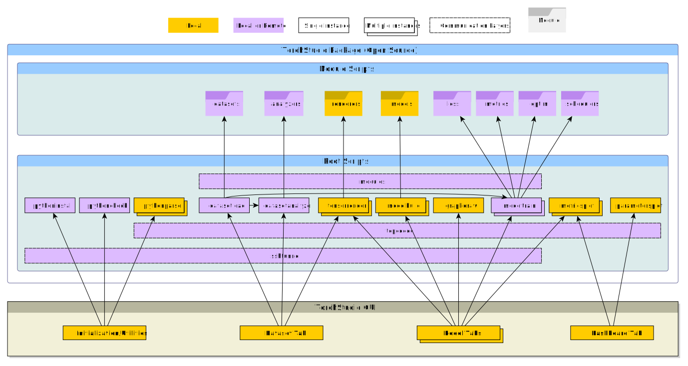

TorchStudio Package
-------------------

The torchstudio package contains 2 levels of scripts:
- Modules (files in the subfolders of the torchstudio package folder)
- Root (files in the torchstudio package folder)

Modules
-------

Additional modules scripts can be added to the following torchstudio subfolders:

- **analyzers**: analyze a dataset, fill a weights list if relevant, and generate a PIL image report (classes inheriting from torchstudio.modules.Analyzer)
- **datasets**: define a tensors dataset (classes inheriting from torch.utils.data.Dataset)
- **loss**: calculate loss between inference and target (classes inheriting from torch.nn.Modules._Loss)
- **metrics**: calculate evaluation metric between inference and target (classes inheriting from torchstudio.modules.Metric or torchmetrics.metric.Metric or - catalyst.metrics._metric.IMetric or ignite.metrics.metric.Metric (with some adaptation to update()))
- **models**: define a neural network model (classes inheriting from torch.nn.Module)
- **optim**: optimize model's weights (classes inheriting from torch.optim.Optimizer)
- **renderers**: render a numpy tensor into a PIL image (classes inheriting from torchstudio.modules.Renderer)
- **schedulers**: adjust optimizer learning rate (classes inheriting from torch.optim._LRScheduler)

These modules are exposed in the application as follow:
- The **Dataset** tab expose the modules from the following folders: datasets, analyzers, renderers
- The **Model** tabs expose the modules from the following folders: models, loss, metrics, optim, schedulers

Root Scripts
------------

The root scripts are management routines interfacing the modules and other processing tasks with the main application.

- **datasetload.py**: handles dataset tensors transfer (started locally or remotely when clicking the Load button in the Dataset tab)
- **datasetanalyze.py**: handles dataset tensors analysis (started locally or remotely when clicking the Analyze button in the Dataset tab)
- **graphdraw.py**: draw model graph into svg (started locally by the graph display in the Model tabs)
- **metricsplot.py**: plot training metrics into an image (started locally by the metrics display in the Model and Dashboard tabs)
- **modelbuild.py**: build, package and graph a model (started locally when clicking the Build button in the Model tabs)
- **modeltrain.py**: handles the model training and inference (started locally or remotely when clicking the Train button in the Model tabs)
- **modules.py**: definition for base classes used by modules in sub folders
- **parametersplot.py**: plot parameters into an image (started locally by the parameters display in the Dashboard tab)
- **pythoncheck.py**: check python satisfies the requirements (started locally when launching the application)
- **pythoninstall.py**: install the necessary python conda packages (started locally when setting up the application)
- **pythonparse.py**: parse modules and code chunks (started locally when launching the application)
- **sshtunnel.py**: ssh tunnel to execute scripts remotely as if they were local (started locally to launch remote scripts)
- **tcpcodec.py**: tcp socket communication functions (used locally and remotely by the other root scripts)
- **tensorrender.py**: handles the rendering of tensors into images (started locally by the tensor displays in the Dataset and Model tabs)
